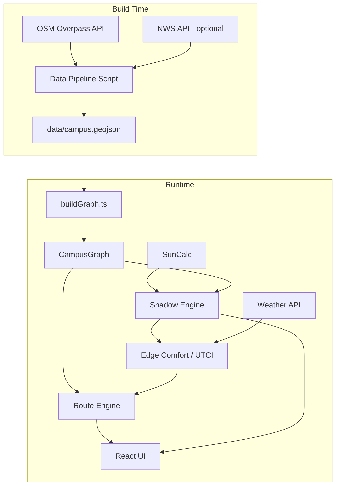
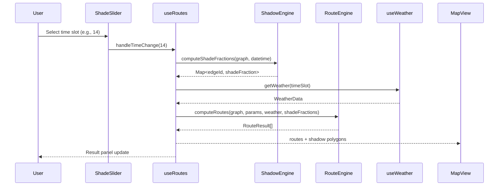

# Design Document: Comfort-Aware Routing

## Overview

Comfort-Aware Routing upgrades the ShadowPath routing engine from static, hand-seeded campus data to a real-data pipeline backed by OpenStreetMap and dynamic solar geometry. The key changes are:

1. **Data Pipeline** — A Node.js script fetches building footprints (polygons with heights), tree locations (with canopy dimensions), walking paths (with surface types), and POIs (water fountains, cooling zones, shuttle stops) from the OSM Overpass API, transforms them into the campus GeoJSON format, and writes `data/campus.geojson`.
2. **Shadow Engine** — Replaces the static `shade: {"10": N, "14": N, "18": N}` values with dynamic shadow computation using SunCalc solar positions, building footprint projection, and tree canopy shadow circles. Shadows are computed on-demand for any of 8 two-hour time slots.
3. **UTCI Computation** — Enhances the existing simplified UTCI module with surface albedo, wind canyon effects, and MRT derived from dynamic shade fractions instead of static shade percentages.
4. **Graph & Type Upgrades** — Extends `GraphNode` and `GraphEdge` with polygon footprints, surface types, access restrictions, wind canyon factors, and a dynamic shade computation interface.
5. **Comfort-Aware Dijkstra** — The existing `comfortAwareRoute` is updated to use dynamic shade fractions and the enhanced UTCI as the primary edge cost.
6. **8-Slot Shade Slider** — Expands from 3 fixed times to 8 two-hour slots (6 AM through 8 PM), with backward-compatible mapping for legacy `10 | 14 | 18` code.
7. **Backward Compatibility** — All existing route types, the HeatShield Planner, and the legacy Exposure_Score continue to work.

### Key Design Principles

- **Hackathon pragmatism**: Favor simple, working implementations over theoretical perfection. Use bounding-box approximations for shadows rather than exact polygon clipping where it saves complexity.
- **Pure computation core**: The shadow engine, UTCI module, and routing algorithms remain pure functions — no side effects, fully testable with fast-check.
- **Incremental upgrade**: The data pipeline is a separate build step. The runtime code works with whatever `campus.geojson` it finds — old format or new.
- **Research-grounded**: Shadow projection geometry and UTCI thresholds follow published methods (CoolWalks, Brode et al. 2012).

---

## Architecture

### System Architecture



### New Module Layout

```
lib/
  data/
    loadDataset.ts            # Existing — loads campus.geojson
    pipeline/
      fetchBuildings.ts       # Overpass query for buildings
      fetchTrees.ts           # Overpass query for trees
      fetchPaths.ts           # Overpass query for walking paths
      fetchPOIs.ts            # Overpass query for POIs
      transformToGeoJSON.ts   # Merge + transform to campus GeoJSON schema
      overpassClient.ts       # Shared Overpass HTTP client with retry
      generateData.ts         # CLI entry point (npm run generate-data)
  shadow/
    shadowEngine.ts           # Building + tree shadow computation
    buildingShadow.ts         # Project building footprint → shadow polygon
    treeShadow.ts             # Project tree canopy → shadow circle
    shadeFraction.ts          # Compute shade fraction for a path edge
    types.ts                  # Shadow engine types
  comfort/
    utci.ts                   # Existing — enhanced with surface albedo
    edgeComfort.ts            # Existing — uses dynamic shade
    windCanyon.ts             # Wind canyon effect computation
    surfaceAlbedo.ts          # Surface type → albedo mapping
  graph/
    buildGraph.ts             # Existing — extended for new schema
    types.ts                  # Existing — extended types
  routing/
    dijkstra.ts               # Existing — unchanged
    comfortAwareRoute.ts      # Existing — updated weight function
    ...                       # Other existing route modules
  weather/
    fetchWeather.ts           # Existing — extended for 8 time slots
    types.ts                  # Existing — extended

components/
  ShadeSlider.tsx             # Updated: 8 time slots
  MapView.tsx                 # Updated: shadow overlay, indoor paths
```

### Data Flow (Updated)



---

## Components and Interfaces

### Data Pipeline (`lib/data/pipeline/`)

The pipeline is a standalone Node.js script run via `npm run generate-data`. It is NOT part of the runtime bundle.

#### overpassClient.ts

```typescript
interface OverpassClientOptions {
  bbox: [number, number, number, number]; // [south, west, north, east]
  timeout?: number; // ms, default 30000
}

async function queryOverpass(query: string, options: OverpassClientOptions): Promise<unknown>;
```

Sends Overpass QL queries to `https://overpass-api.de/api/interpreter`. Retries once on 429/503. Returns raw JSON response.

#### fetchBuildings.ts

```typescript
interface RawBuilding {
  osmId: number;
  name: string | null;
  footprint: GeoJSON.Polygon;
  heightMeters: number;
  levels: number | null;
}

async function fetchBuildings(bbox: BBox): Promise<RawBuilding[]>;
```

Overpass query: `way["building"]["building"!="no"](bbox);` — fetches all building ways within the ASU bounding box. Extracts `name`, `height`, `building:levels`. Applies the height fallback: `levels * 3.5` or default 10m.

#### fetchTrees.ts

```typescript
interface RawTree {
  osmId: number;
  location: [number, number]; // [lng, lat]
  species: string | null;
  canopyRadiusMeters: number;
  heightMeters: number;
  canopyDensity: number;
}

async function fetchTrees(bbox: BBox): Promise<RawTree[]>;
```

Overpass query: `node["natural"="tree"](bbox);`. Defaults: canopy radius 4m, height 8m, density 0.7.

#### fetchPaths.ts

```typescript
interface RawPath {
  osmId: number;
  geometry: GeoJSON.LineString;
  surface: string | null;
  highway: string;
  accessible: boolean;
  access: string | null;
}

async function fetchPaths(bbox: BBox): Promise<RawPath[]>;
```

Overpass query: `way["highway"~"footway|path|pedestrian|steps"](bbox);`. Sets `accessible = false` for `highway=steps` or `wheelchair=no`.

#### fetchPOIs.ts

```typescript
interface RawPOI {
  osmId: number;
  location: [number, number];
  type: "water_refill" | "cooling_point" | "shuttle_stop" | "shelter";
  name: string | null;
  accessible: boolean;
}

async function fetchPOIs(bbox: BBox): Promise<RawPOI[]>;
```

Multiple Overpass queries for `amenity=drinking_water`, `amenity=shelter`, `highway=bus_stop`, and cooling-eligible buildings.

#### transformToGeoJSON.ts

```typescript
function transformToGeoJSON(
  buildings: RawBuilding[],
  trees: RawTree[],
  paths: RawPath[],
  pois: RawPOI[]
): GeoJSON.FeatureCollection;
```

This is the core transform. It:
1. Creates building node features with Polygon geometry and `heightMeters`.
2. Creates tree node features with Point geometry and canopy properties.
3. Splits path LineStrings at intersections to create graph edges.
4. Snaps POIs to nearest path nodes.
5. Computes `distanceMeters` for each edge using Turf.js `length()`.
6. Assigns `surfaceType` from OSM `surface` tag.
7. Assigns `accessRestriction` from OSM `access` tag.
8. Validates all edge node references.

#### generateData.ts (CLI)

```typescript
// Entry point: npm run generate-data [--force]
// 1. Check cache: if campus.geojson exists and < 24h old, skip (unless --force)
// 2. Fetch all data from Overpass
// 3. Transform to GeoJSON
// 4. Validate against schema
// 5. Write to data/campus.geojson
```

### Shadow Engine (`lib/shadow/`)

#### types.ts

```typescript
type TimeSlot = 6 | 8 | 10 | 12 | 14 | 16 | 18 | 20;

interface SolarPosition {
  azimuthRad: number;   // radians from north, clockwise
  altitudeRad: number;  // radians above horizon
}

interface ShadowPolygon {
  sourceId: string;      // building or tree ID
  polygon: GeoJSON.Polygon;
  type: "building" | "tree";
  density: number;       // 1.0 for buildings, 0-1 for trees
}

interface ShadeFractionResult {
  shadeFraction: number; // 0-1
  buildingShade: number; // 0-1 contribution from buildings
  treeShade: number;     // 0-1 contribution from trees
}
```

#### shadowEngine.ts

The main orchestrator. For a given datetime:

```typescript
function computeAllShadows(
  buildings: BuildingFeature[],
  trees: TreeFeature[],
  datetime: Date,
  campusLat: number,
  campusLng: number
): ShadowPolygon[];

function computeEdgeShadeFractions(
  edges: Map<string, GraphEdge>,
  shadows: ShadowPolygon[]
): Map<string, ShadeFractionResult>;
```

**Algorithm**:
1. Call `SunCalc.getPosition(datetime, lat, lng)` to get solar azimuth and altitude.
2. If altitude ≤ 0 → return shade fraction 1.0 for all edges (nighttime).
3. For each building: project footprint polygon into shadow polygon using `buildingShadow.ts`.
4. For each tree: project canopy circle into shadow ellipse using `treeShadow.ts`.
5. For each edge: compute intersection length with all shadow polygons using Turf.js `lineIntersect` / `booleanIntersects`, sum shaded length, divide by total length. Cap at 1.0.

#### buildingShadow.ts

```typescript
function projectBuildingShadow(
  footprint: GeoJSON.Polygon,
  heightMeters: number,
  solar: SolarPosition
): GeoJSON.Polygon;
```

**Shadow projection geometry**: Each vertex of the building footprint is offset by:
- `dx = height / tan(altitude) * sin(azimuth)` (in meters, converted to degrees)
- `dy = height / tan(altitude) * cos(azimuth)` (in meters, converted to degrees)

The shadow polygon is the union of the original footprint and the offset footprint. For hackathon simplicity, we use the convex hull of original + offset vertices rather than exact polygon union.

#### treeShadow.ts

```typescript
function projectTreeShadow(
  location: [number, number],
  heightMeters: number,
  canopyRadiusMeters: number,
  canopyDensity: number,
  solar: SolarPosition
): ShadowPolygon;
```

Projects the canopy center point by the same offset formula as buildings, then creates a circle (approximated as an 8-sided polygon) with the canopy radius at the projected center. The `density` field scales the effective shade contribution.

#### shadeFraction.ts

```typescript
function computeShadeFraction(
  edgeGeometry: GeoJSON.LineString,
  edgeLengthMeters: number,
  shadows: ShadowPolygon[]
): ShadeFractionResult;
```

For each shadow polygon, compute the length of the edge that intersects it using Turf.js. Building shadows contribute at density 1.0, tree shadows at their canopy density. Overlapping shadows are handled by sampling points along the edge (every 5 meters) and checking if each point falls within any shadow polygon. The fraction is `shadedPoints / totalPoints`. This avoids complex polygon union operations.

**Performance note**: Point sampling at 5m intervals for ~50-100 edges with ~20-50 shadow sources should complete well within the 3-second budget. If needed, we can increase the sampling interval.

### Enhanced Edge Comfort (`lib/comfort/`)

#### surfaceAlbedo.ts

```typescript
type SurfaceType = "asphalt" | "concrete" | "grass" | "paving_stones" | "covered_walkway" | "indoor" | "unknown";

const SURFACE_ALBEDO: Record<SurfaceType, number> = {
  asphalt: 0.1,
  concrete: 0.3,
  grass: 0.25,
  paving_stones: 0.2,
  covered_walkway: 0.4,
  indoor: 0.0,
  unknown: 0.15,
};

function getSurfaceAlbedo(surfaceType: SurfaceType): number;
```

#### windCanyon.ts

```typescript
/**
 * Compute wind modification factor based on street canyon geometry.
 * H/W ratio > 1 → reduced wind (canyon trapping)
 * H/W ratio < 0.5 → increased wind (open exposure)
 * Returns a factor in [0.3, 1.5] applied to ambient wind speed.
 */
function computeWindCanyonFactor(
  adjacentBuildingHeights: number[],
  streetWidthMeters: number
): number;
```

Simple model: `factor = clamp(1.0 - 0.4 * (avgHeight / streetWidth - 0.5), 0.3, 1.5)`. Pre-computed during data pipeline and stored on each edge as `windCanyonFactor`.

#### Updated edgeComfort.ts

The existing `computeEdgeComfort` is updated to:
1. Accept a `shadeFraction: number` parameter (0-1) instead of reading from `edge.shade[timeKey]`.
2. Use `surfaceAlbedo` to modulate MRT: higher albedo → lower MRT contribution.
3. Apply `windCanyonFactor` to modify effective wind speed.
4. Apply MRT reduction for `covered_walkway` and `indoor` surface types.

```typescript
function computeEdgeComfort(
  edge: GraphEdge,
  shadeFraction: number,
  weather: EdgeWeatherSnapshot,
  options?: { surfaceType?: SurfaceType; windCanyonFactor?: number }
): EdgeComfort;
```

**MRT calculation update**:
```
baseMrtUplift = SUN_MRT_UPLIFT_C * (1 - shadeFraction) + FULL_SHADE_MRT_UPLIFT_C * shadeFraction
albedoReduction = baseMrtUplift * surfaceAlbedo  // higher albedo reflects more, less radiant heat
mrtUplift = baseMrtUplift - albedoReduction
mrtC = airTempC + mrtUplift
```

For `covered_walkway`: `mrtUplift *= 0.3` (70% reduction from overhead cover).
For `indoor`: short-circuit to fixed 22°C as before.

### Updated ShadeSlider

```typescript
type TimeSlot = 6 | 8 | 10 | 12 | 14 | 16 | 18 | 20;

const TIME_SLOTS: TimeSlot[] = [6, 8, 10, 12, 14, 16, 18, 20];
const TIME_LABELS: Record<TimeSlot, string> = {
  6: "6 AM", 8: "8 AM", 10: "10 AM", 12: "12 PM",
  14: "2 PM", 16: "4 PM", 18: "6 PM", 20: "8 PM",
};

interface ShadeSliderProps {
  value: TimeSlot;
  onChange: (value: TimeSlot) => void;
}
```

The slider renders 8 buttons in a horizontal row. Keyboard arrow keys cycle through all 8 slots. The `role="slider"` ARIA attributes are updated with `aria-valuemin={6}` and `aria-valuemax={20}`.

### Backward Compatibility Layer

```typescript
type LegacyTimeOfDay = 10 | 14 | 18;

function isLegacyTime(t: number): t is LegacyTimeOfDay {
  return t === 10 || t === 14 || t === 18;
}

function toLegacyTime(slot: TimeSlot): LegacyTimeOfDay {
  if (slot <= 10) return 10;
  if (slot <= 16) return 14;
  return 18;
}
```

The `RouteParams.timeOfDay` type is widened to `TimeSlot` but legacy code passing `10 | 14 | 18` continues to work since those are valid `TimeSlot` values. The `computeRoutes` function detects whether shade fractions are provided dynamically or need to fall back to static `edge.shade[timeKey]`.

---

## Data Models

### Updated GeoJSON Schema

#### Building Node Features (Polygon geometry — NEW)

```typescript
interface BuildingNodeProperties {
  type: "building";
  id: string;
  name: string;
  accessible: boolean;
  heightMeters: number;
  // footprint is the feature's Polygon geometry itself
}
```

#### Tree Node Features (Point geometry — NEW)

```typescript
interface TreeNodeProperties {
  type: "tree";
  id: string;
  name: string;
  accessible: true;
  heightMeters: number;
  canopyRadiusMeters: number;
  canopyDensity: number;
  species: string | null;
}
```

#### Updated Edge Properties

```typescript
interface CampusEdgeProperties {
  type: "path";
  id: string;
  fromNodeId: string;
  toNodeId: string;
  distanceMeters: number;
  accessible: boolean;
  surfaceType: SurfaceType;
  accessRestriction: "public" | "student_only" | "staff_only";
  windCanyonFactor: number; // 0.3-1.5
  hasCoolingPoint: boolean;
  hasWaterRefill: boolean;
  isIndoor?: boolean;
  shadeStructures: string[];
  // Legacy shade field preserved for backward compat
  shade: { "10": number; "14": number; "18": number };
}
```

### Updated GraphNode

```typescript
interface GraphNode {
  id: string;
  name: string;
  accessible: boolean;
  type: "building" | "cooling_point" | "water_refill" | "intersection" | "tree" | "shuttle_stop";
  coordinates: [number, number];
  // New optional fields
  footprintPolygon?: GeoJSON.Polygon;
  heightMeters?: number;
  canopyRadiusMeters?: number;
  canopyDensity?: number;
  species?: string;
  demoHeatIndex?: number;
}
```

### Updated GraphEdge

```typescript
interface GraphEdge {
  id: string;
  from: string;
  to: string;
  distanceMeters: number;
  accessible: boolean;
  shade: Record<"10" | "14" | "18", number>; // Legacy, kept for backward compat
  hasCoolingPoint: boolean;
  hasWaterRefill: boolean;
  isIndoor?: boolean;
  geometry: GeoJSON.LineString;
  // New fields
  surfaceType: SurfaceType;
  accessRestriction: "public" | "student_only" | "staff_only";
  windCanyonFactor: number;
}
```

### Updated RouteParams

```typescript
type TimeSlot = 6 | 8 | 10 | 12 | 14 | 16 | 18 | 20;

interface RouteParams {
  origin: string;
  destination: string;
  timeOfDay: TimeSlot;
  accessibilityMode: boolean;
  accessLevel?: "public" | "student" | "staff"; // default: "student"
  comfortWeights?: ComfortWeights;
}
```

### Updated RouteResult

```typescript
interface RouteResult {
  type: RouteType[];
  path: string[];
  edges: GraphEdge[];
  distanceMeters: number;
  durationMinutes: number;
  shadePercentage: number;
  sunExposureMinutes: number;
  coolingStopCount: number;
  exposureScore: number;        // Legacy, kept for backward compat
  confidenceLabel: ConfidenceLabel;
  safetyVerdict: SafetyVerdict;
  averageUtciC: number;         // Now required
  utciStress: UtciStress;       // Now required
  utciStressLabel: string;      // Now required
  indoorMeters: number;         // Now required
  waterStationCount: number;    // NEW
  coolingZoneCount: number;     // NEW
  dataSources: string[];
  assumptions: string[];
  geometry: GeoJSON.FeatureCollection;
}
```

### Updated WeatherData

```typescript
interface WeatherData {
  heatIndex: number;
  temperature: number;
  relativeHumidity: number;
  windSpeedMps: number;
  windDirectionDeg?: number;    // NEW: degrees from north
  confidence: "High" | "Medium" | "Low";
  source: "nws-live" | "nws-forecast" | "demo-fallback";
  fetchedAt: Date | null;
}
```


---

## Correctness Properties

*A property is a characteristic or behavior that should hold true across all valid executions of a system — essentially, a formal statement about what the system should do. Properties serve as the bridge between human-readable specifications and machine-verifiable correctness guarantees.*

### Property 1: Shadow length increases as solar altitude decreases

*For any* building footprint with height > 0 and *for any* two solar altitudes `a1 > a2 > 0`, the shadow polygon projected at altitude `a2` SHALL have a greater area (or equal area) than the shadow polygon projected at altitude `a1`.

**Validates: Requirements 6.2, 17.1**

### Property 2: Shade fraction is always in [0, 1]

*For any* path edge and *for any* combination of building shadow polygons and tree canopy shadow circles (with any canopy densities in [0, 1]), the computed `Shade_Fraction` SHALL be in the closed interval [0, 1].

**Validates: Requirements 6.3, 7.3, 7.4, 7.5, 17.2, 17.6**

### Property 3: Nighttime shade fraction equals 1.0

*For any* path edge, WHEN the solar altitude is at or below 0 degrees, the computed `Shade_Fraction` SHALL equal 1.0.

**Validates: Requirements 6.4, 17.3**

### Property 4: UTCI increases monotonically with air temperature

*For any* valid UTCI input where mean radiant temperature, wind speed, and relative humidity are held constant, increasing the air temperature SHALL increase the computed UTCI value.

**Validates: Requirements 9.1, 17.4**

### Property 5: Indoor edge UTCI is less than outdoor sun-exposed edge UTCI in hot conditions

*For any* outdoor air temperature exceeding 30°C, the UTCI computed for an indoor edge (fixed 22°C climate-controlled) SHALL be less than the UTCI computed for an equivalent outdoor edge with 0% shade (full sun exposure).

**Validates: Requirements 10.2, 17.5**

### Property 6: GeoJSON round-trip through pipeline and buildGraph

*For any* valid campus GeoJSON produced by the Data_Pipeline `transformToGeoJSON` function, parsing it through `buildGraph` SHALL produce a valid `CampusGraph` where the node count equals the number of node features and the edge count equals the number of edge features in the source GeoJSON.

**Validates: Requirements 5.4, 15.6, 17.7**

### Property 7: Data pipeline default values are applied correctly

*For any* building lacking both `height` and `building:levels` tags, the assigned `heightMeters` SHALL be 10. *For any* building with a `building:levels` tag but no `height` tag, `heightMeters` SHALL equal `levels * 3.5`. *For any* tree lacking a `diameter_crown` tag, `canopyRadiusMeters` SHALL be 4. *For any* tree lacking a `height` tag, `heightMeters` SHALL be 8. *For any* tree, `canopyDensity` SHALL be in [0, 1].

**Validates: Requirements 1.4, 1.6, 2.3, 2.4, 2.5**

### Property 8: Access restriction filtering excludes restricted edges

*For any* campus graph and *for any* origin-destination pair, when the user access level is `public`, every edge in every returned route SHALL have `accessRestriction` equal to `public`. When the access level is `student`, no edge SHALL have `accessRestriction` equal to `staff_only`.

**Validates: Requirements 11.2, 11.3, 11.4**

### Property 9: UTCI safety classification is consistent with thresholds

*For any* UTCI value, the safety classification SHALL be `"lower-risk"` if UTCI < 32°C, `"higher-risk"` if 32°C ≤ UTCI < 38°C, and `"not-recommended"` if UTCI ≥ 38°C.

**Validates: Requirements 12.5**

### Property 10: Higher surface albedo produces lower or equal MRT contribution

*For any* two surface types where `albedo(type1) > albedo(type2)`, and *for any* identical weather conditions and shade fraction, the MRT computed for `type1` SHALL be less than or equal to the MRT computed for `type2`.

**Validates: Requirements 9.3, 9.4, 9.5**

### Property 11: Wind canyon factor is bounded

*For any* valid combination of adjacent building heights and street width, the computed `windCanyonFactor` SHALL be in the closed interval [0.3, 1.5].

**Validates: Requirements 9.2**

---

## Error Handling

| Scenario | Behaviour |
|---|---|
| Overpass API unreachable during `generate-data` | Fall back to most recent cached `campus.geojson`; log warning |
| Overpass returns < 3 POIs for a category | Log warning; supplement with manually curated fallback data |
| NWS API unreachable at runtime | Use demo fallback (42°C, 18% RH, 2.2 m/s wind); Confidence_Label = "Low" |
| GeoJSON file missing or malformed | Display "Campus data unavailable" error; disable route form (existing behavior) |
| Building missing height and levels tags | Default to 10m height |
| Tree missing canopy dimensions | Default to 4m radius, 8m height, 0.7 density |
| Path missing surface tag | Assign `surfaceType: "unknown"` with albedo 0.15 |
| Path missing access tag | Assign `accessRestriction: "public"` |
| Solar altitude ≤ 0 (nighttime) | All edges get Shade_Fraction = 1.0 (full shade) |
| Shadow computation exceeds 3s budget | Log performance warning; return partial results with available shadows |
| Origin/destination not found in graph | Inline form error (existing behavior) |
| No path exists between nodes | "No route found" message (existing behavior) |
| Legacy code uses `10 \| 14 \| 18` time values | Accepted as valid TimeSlot values; backward compatible |
| Edge missing new fields (old GeoJSON format) | Apply defaults: `surfaceType: "unknown"`, `accessRestriction: "public"`, `windCanyonFactor: 1.0` |

---

## Testing Strategy

### Framework

All tests use **Vitest** with the `@fast-check/vitest` adapter for property-based testing. No other test framework is introduced.

### PBT Applicability Assessment

The comfort-aware routing feature has a rich pure-function computation layer: shadow projection geometry, UTCI computation, shade fraction calculation, data pipeline transformations, and routing cost functions. These are all pure functions with large input spaces and universal properties. Property-based testing is highly appropriate.

PBT is NOT used for:
- Overpass API integration (external service) — mock-based integration tests
- NWS API integration (external service) — mock-based integration tests
- Map rendering (MapLibre GL JS) — example-based tests
- UI layout and slider rendering — example-based + axe-core tests
- File I/O in the data pipeline — mock-based integration tests

### Property-Based Tests (Vitest + fast-check)

Each property test runs a minimum of **100 iterations**. Each test is tagged with a comment referencing the design property.

Tag format: **Feature: comfort-aware-routing, Property {number}: {property_text}**

| Property | Test File | Generator Strategy |
|---|---|---|
| P1: Shadow length metamorphic | `shadow/buildingShadow.test.ts` | Arbitrary convex polygons, heights > 0, two altitudes in (0, π/2) |
| P2: Shade fraction in [0,1] | `shadow/shadeFraction.test.ts` | Arbitrary LineStrings, arbitrary shadow polygon sets with densities in [0,1] |
| P3: Nighttime shade = 1.0 | `shadow/shadowEngine.test.ts` | Arbitrary edges, solar altitude ≤ 0 |
| P4: UTCI monotonic with temp | `comfort/utci.test.ts` | Arbitrary MRT, wind, humidity; two air temps where t1 < t2 |
| P5: Indoor < outdoor when hot | `comfort/edgeComfort.test.ts` | Arbitrary outdoor temp > 30°C, arbitrary humidity and wind |
| P6: GeoJSON round-trip | `graph/buildGraph.test.ts` | Arbitrary valid GeoJSON with buildings, trees, paths, POIs |
| P7: Pipeline defaults | `data/pipeline/transform.test.ts` | Arbitrary buildings/trees with missing optional fields |
| P8: Access restriction filtering | `routing/accessRestriction.test.ts` | Arbitrary graphs with mixed access restrictions, all access levels |
| P9: UTCI safety thresholds | `comfort/utci.test.ts` | Arbitrary UTCI values in [-20, 60] |
| P10: Albedo → MRT monotonicity | `comfort/edgeComfort.test.ts` | Arbitrary weather, shade fraction; pairs of surface types with different albedos |
| P11: Wind canyon factor bounds | `comfort/windCanyon.test.ts` | Arbitrary building heights > 0, street widths > 0 |

### Unit / Example Tests

- `shadow/buildingShadow.test.ts`: Known building (10m square, 15m tall) at solar noon → expected shadow shape
- `shadow/treeShadow.test.ts`: Known tree (8m tall, 4m canopy) at 45° altitude → expected shadow offset
- `comfort/surfaceAlbedo.test.ts`: Each SurfaceType maps to expected albedo value
- `comfort/edgeComfort.test.ts`: Indoor edge always returns ~22°C UTCI regardless of weather
- `routing/comfortAwareRoute.test.ts`: Graph where comfort route differs from shortest route
- `components/ShadeSlider.test.tsx`: 8 buttons rendered; ArrowRight cycles through all slots
- `data/pipeline/fetchBuildings.test.ts`: Mock Overpass response → correct RawBuilding[] extraction
- `routing/computeRoutes.test.ts`: Legacy `10 | 14 | 18` time values produce valid results
- `routing/heatSafetyGate.test.ts`: UTCI boundary tests at 31.9, 32.0, 37.9, 38.0

### Integration / Smoke Tests

- Load generated `campus.geojson` and assert ≥ 20 buildings with Polygon geometry
- Load generated `campus.geojson` and assert ≥ 50 path edges
- Full `computeRoutes` with new graph produces all 4 route types
- All existing ShadowPath and HeatShield Planner tests continue to pass
- Shadow computation for full campus completes within 3 seconds
- axe-core audit on updated ShadeSlider component
