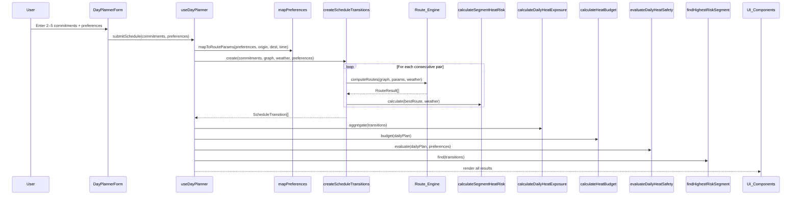

# Design Document: HeatShield Planner

## Overview

HeatShield Planner is an add-on feature for the existing ShadowPath campus routing application. While ShadowPath handles single-route comparison between two campus locations, HeatShield Planner extends the app into a full-day heat-risk planner. Users enter 2–5 campus commitments for their day, and the planner calculates route segments between each consecutive pair, produces per-transition heat-risk analysis, aggregates a daily heat exposure budget, identifies the highest-risk segment, and recommends cooling breaks, water refills, and shuttle alternatives.

The feature is implemented as a separate module layer (`lib/planner/`, `components/planner/`) that calls into the existing Route_Engine without modifying it. All new planner logic is composed of pure functions, making it fully testable with property-based tests via Vitest + fast-check.

### Key Design Principles

- **Additive only**: No existing files are modified except `Nav.tsx` (new links) and `campus.geojson` (shuttle stop data). All new logic lives in `lib/planner/` and `components/planner/`.
- **Pure computation core**: Every planner function is pure — explicit inputs, explicit outputs, no side effects.
- **Reuse existing Route_Engine**: The planner calls `computeRoutes()` for each transition rather than reimplementing routing.
- **Responsible language**: Risk labels use "lower-risk", "higher-risk", "not recommended" — never "safe".
- **Accessibility by default**: All new components are keyboard-navigable and screen-reader compatible.

---

## Architecture

### New File Structure

```
lib/planner/
  types.ts                        # All new TypeScript types
  createScheduleTransitions.ts    # Schedule → transitions via Route_Engine
  calculateSegmentHeatRisk.ts     # Per-segment risk metrics
  calculateDailyHeatExposure.ts   # Full-day aggregate metrics
  findHighestRiskSegment.ts       # Identify worst segment
  recommendCoolingBreaks.ts       # Cooling point recommendations
  recommendWaterStops.ts          # Water refill recommendations
  recommendShuttleAlternatives.ts # Shuttle stop recommendations
  calculateHeatBudget.ts          # Heat budget computation
  evaluateDailyHeatSafety.ts      # Full-day safety gate
  mapPreferences.ts               # Map PersonalHeatMode → RouteParams

components/planner/
  DayPlannerForm.tsx              # Schedule input form (2–5 commitments)
  PersonalHeatModePanel.tsx       # Heat mode preference toggles
  TransitionCard.tsx              # Per-transition result card
  HeatBudgetDashboard.tsx         # Heat budget visual indicator
  HighestRiskExplanation.tsx      # Highest-risk segment explanation card
  ShuttleRecommendation.tsx       # Shuttle alternative display
  CoolingWaterRecommendation.tsx  # Cooling/water recommendation display
  DailyPlanSummary.tsx            # Full-day aggregate summary
  DailySafetyBadge.tsx            # Daily risk level badge

hooks/
  useDayPlanner.ts                # Orchestrates planner computation + state

src/app/planner/
  page.tsx                        # Day Planner page

src/app/why-this-matters/
  page.tsx                        # Why This Matters page (judging rubric)

__tests__/planner/
  createScheduleTransitions.test.ts
  calculateSegmentHeatRisk.test.ts
  calculateDailyHeatExposure.test.ts
  findHighestRiskSegment.test.ts
  recommendCoolingBreaks.test.ts
  recommendWaterStops.test.ts
  recommendShuttleAlternatives.test.ts
  calculateHeatBudget.test.ts
  evaluateDailyHeatSafety.test.ts
  DayPlannerForm.test.tsx
  HeatBudgetDashboard.test.tsx
```

### Data Flow



### State Management

State is managed with React hooks — consistent with the existing ShadowPath pattern:

| State | Location | Description |
|---|---|---|
| `commitments` | `useDayPlanner` | Array of CampusCommitment (2–5) |
| `personalHeatMode` | `useDayPlanner` | PersonalHeatMode preferences |
| `transitions` | `useDayPlanner` | Computed ScheduleTransition[] |
| `dailyPlan` | `useDayPlanner` | DailyHeatPlan with aggregates |
| `heatBudget` | `useDayPlanner` | HeatBudget dashboard data |
| `safetyEvaluation` | `useDayPlanner` | DailySafetyEvaluation |
| `highestRiskSegment` | `useDayPlanner` | The worst ScheduleTransition |
| `weatherData` | `useWeather` (reused) | WeatherData from existing hook |

---

## Components and Interfaces

### DayPlannerForm

Renders a form for entering 2–5 campus commitments. Each commitment row has: location dropdown (campus buildings), start time input, optional end time, flexibility toggle (fixed/flexible), and a text label. Includes "Add Commitment" and "Remove" buttons. Validates min 2, max 5 commitments. Provides a "Load Demo Schedule" button that populates four commitments. All inputs have `<label>` elements and are keyboard-navigable.

```typescript
interface DayPlannerFormProps {
  onSubmit: (commitments: CampusCommitment[], preferences: PersonalHeatMode) => void;
  disabled?: boolean;
}
```

### PersonalHeatModePanel

A panel of toggle switches for heat mode preferences. Each toggle is a labeled checkbox. Persists to session state (React state, not localStorage — session duration only). Accessible via keyboard with proper `role` and `aria-checked` attributes.

```typescript
interface PersonalHeatModePanelProps {
  value: PersonalHeatMode;
  onChange: (mode: PersonalHeatMode) => void;
}
```

### TransitionCard

Displays per-transition metrics: origin → destination, time window, walking time, sun exposure, shade %, cooling/water availability, confidence label, risk level, and any recommendations. Uses the existing `ConfidenceBadge` component for confidence display.

```typescript
interface TransitionCardProps {
  transition: ScheduleTransition;
  isHighestRisk: boolean;
}
```

### HeatBudgetDashboard

Renders the heat budget as a segmented progress bar. Each segment is color-coded by risk level. Shows remaining budget, consumed budget, highest-risk time block, recommended cooling break timing, and estimated reduction. All visual indicators have ARIA labels.

```typescript
interface HeatBudgetDashboardProps {
  budget: HeatBudget;
  transitions: ScheduleTransition[];
}
```

### HighestRiskExplanation

An explanation card for the highest-risk segment. Shows the time window, origin/destination, reason for high risk, risk level, and at least three recommended actions. When shuttle preference is enabled and segment is "higher-risk" or "not recommended", shuttle recommendation appears first.

```typescript
interface HighestRiskExplanationProps {
  transition: ScheduleTransition;
  preferences: PersonalHeatMode;
}
```

### DailyPlanSummary

Displays full-day aggregate metrics: total outdoor walking minutes, total sun exposure, average shade %, total cooling stops, and estimated heat exposure reduction vs shortest-route-only.

```typescript
interface DailyPlanSummaryProps {
  dailyPlan: DailyHeatPlan;
  safetyEvaluation: DailySafetyEvaluation;
}
```

### DailySafetyBadge

Displays the daily risk level using responsible language. Color-coded: green for "lower-risk", amber for "higher-risk", red for "not recommended". Uses `role="status"` and descriptive `aria-label`.

```typescript
interface DailySafetyBadgeProps {
  riskLevel: RiskLevel;
}
```

---

## Data Models

### New Types (`lib/planner/types.ts`)

```typescript
/** Risk level labels — never uses the word "safe" */
export type RiskLevel = "lower-risk" | "higher-risk" | "not recommended";

/** A single campus commitment in the user's daily schedule */
export interface CampusCommitment {
  location: string;          // Campus node ID (e.g., "b1")
  startTime: string;         // ISO time string or "HH:MM" format
  endTime?: string;          // Optional end time
  flexibility: "flexible" | "fixed";
  label: string;             // User-provided label (e.g., "CS 101 Lecture")
}

/** Per-segment risk assessment */
export interface RouteSegmentRisk {
  walkingTimeMinutes: number;
  sunExposureMinutes: number;
  shadePercentage: number;
  coolingAvailability: number;   // Count of cooling points on route
  waterAvailability: number;     // Count of water refills on route
  accessibilityCompliant: boolean;
  confidenceLabel: "High" | "Medium" | "Low";
  riskLevel: RiskLevel;
}

/** Cooling break recommendation */
export interface CoolingRecommendation {
  coolingPointName: string;
  distanceFromRouteMeters: number;
  suggestedBreakMinutes: number;
  reason: string;
}

/** Water refill recommendation */
export interface WaterRecommendation {
  waterPointName: string;
  distanceFromRouteMeters: number;
}

/** Shuttle stop data (added to GeoJSON) */
export interface ShuttleStop {
  id: string;
  name: string;
  nearbyBuildings: string[];     // Building node IDs
  coordinates: [number, number]; // [lng, lat]
  estimatedWaitMinutes: number;
  accessible: boolean;
}

/** Shuttle alternative recommendation */
export interface ShuttleAlternative {
  shuttleStopName: string;
  estimatedWaitMinutes: number;
  walkingDistanceMeters: number;
  accessible: boolean;
}

/** A walking segment between two consecutive commitments */
export interface ScheduleTransition {
  origin: CampusCommitment;
  destination: CampusCommitment;
  routeResult: RouteResult | null;  // null if no route found
  segmentRisk: RouteSegmentRisk;
  coolingRecommendation: CoolingRecommendation | null;
  waterRecommendation: WaterRecommendation | null;
  shuttleAlternative: ShuttleAlternative | null;
}

/** Personal heat mode preferences */
export interface PersonalHeatMode {
  standardWalking: boolean;
  lowExertion: boolean;
  wheelchairAccessible: boolean;
  asthmaSensitive: boolean;
  preferShadedPaths: boolean;
  preferWaterRefillStops: boolean;
  preferCoolingStops: boolean;
  preferShuttleAlternatives: boolean;
}

/** Full-day aggregate metrics */
export interface DailyAggregateMetrics {
  totalOutdoorMinutes: number;
  totalSunExposureMinutes: number;
  averageShadePercentage: number;
  totalCoolingStopsAvailable: number;
  highestRiskSegmentIndex: number;
  estimatedReductionPercentage: number;  // vs shortest-route-only
}

/** Complete daily heat plan */
export interface DailyHeatPlan {
  transitions: ScheduleTransition[];
  aggregateMetrics: DailyAggregateMetrics;
}

/** Heat budget dashboard model */
export interface HeatBudget {
  totalBudget: number;           // Always 100
  consumedBudget: number;
  remainingBudget: number;
  highestRiskTimeBlock: string;  // e.g., "2:00 PM – 4:30 PM"
  recommendedCoolingBreak: string | null;  // e.g., "Take a 10-min break at MU Cooling Station around 1:45 PM"
  estimatedReductionPercentage: number;
}

/** Daily safety evaluation output */
export interface DailySafetyEvaluation {
  allowed: boolean;
  riskLevel: RiskLevel;
  blockedSegments: ScheduleTransition[];
  explanation: string;
  recommendations: string[];
}
```

### Shuttle Stop GeoJSON Extension

Three shuttle stops are added to `campus.geojson` with a new node type `"shuttle_stop"`:

```json
{
  "type": "Feature",
  "geometry": { "type": "Point", "coordinates": [-111.9272, 33.4192] },
  "properties": {
    "type": "shuttle_stop",
    "id": "ss1",
    "name": "University Drive Shuttle Stop",
    "nearbyBuildings": ["b1", "b2"],
    "estimatedWaitMinutes": 8,
    "accessible": true
  }
}
```

Three stops will be added:
- `ss1`: University Drive Shuttle Stop (near Hayden Library / Memorial Union)
- `ss2`: Tyler Mall Shuttle Stop (near Fulton Center / Brickyard)
- `ss3`: Rural Road Shuttle Stop (near Biodesign Institute / ISTB4)

The `buildGraph.ts` node type set already uses a `Set` check — shuttle stops are NOT added to the routing graph (they are transit points, not walking nodes). Instead, `recommendShuttleAlternatives` reads shuttle stop data directly from the GeoJSON dataset or a parsed shuttle stop list.

### Graph Node Type Extension

The `CampusNodeProperties.type` union in `lib/graph/types.ts` is NOT modified. Shuttle stops are a separate data concern loaded independently by the planner module. This preserves the existing graph construction and all 63 existing tests.

---

## Pure Utility Functions

### `createScheduleTransitions(commitments, graph, weather, preferences)`

1. Sorts commitments by `startTime` ascending.
2. For each consecutive pair `(commitments[i], commitments[i+1])`:
   a. Maps `PersonalHeatMode` to `RouteParams` via `mapPreferences()`.
   b. Calls `computeRoutes(graph, params, weather)` from the existing Route_Engine.
   c. Selects the best route based on preferences (shade-aware if `preferShadedPaths`, cooling-stop if `preferCoolingStops`, otherwise shortest).
   d. Calls `calculateSegmentHeatRisk()` on the selected route.
   e. Calls `recommendCoolingBreaks()`, `recommendWaterStops()`, `recommendShuttleAlternatives()`.
   f. Assembles a `ScheduleTransition`.
3. Returns `ScheduleTransition[]` of length `N-1`.

### `mapPreferences(preferences, origin, destination, timeOfDay)`

Maps `PersonalHeatMode` to `RouteParams`:
- `accessibilityMode = preferences.wheelchairAccessible`
- `origin`, `destination`, `timeOfDay` passed through

Returns a `RouteParams` object compatible with the existing Route_Engine.

### `calculateSegmentHeatRisk(routeResult, weather)`

Extracts metrics from a `RouteResult` and `WeatherData`:
- `walkingTimeMinutes = routeResult.durationMinutes`
- `sunExposureMinutes = routeResult.sunExposureMinutes`
- `shadePercentage = routeResult.shadePercentage`
- `coolingAvailability = routeResult.coolingStopCount`
- `waterAvailability` = count of edges with `hasWaterRefill`
- `accessibilityCompliant` = all edges have `accessible === true`
- `confidenceLabel = routeResult.confidenceLabel`
- `riskLevel`: derived from `routeResult.exposureScore` using thresholds:
  - `≤ 50` → "lower-risk"
  - `51–75` → "higher-risk"
  - `> 75` → "not recommended"

### `calculateDailyHeatExposure(transitions)`

Aggregates across all transitions:
- `totalOutdoorMinutes = sum(walkingTimeMinutes)`
- `totalSunExposureMinutes = sum(sunExposureMinutes)`
- `averageShadePercentage = weightedAverage(shadePercentage, walkingTimeMinutes)`
- `totalCoolingStopsAvailable = sum(coolingAvailability)`
- `highestRiskSegmentIndex` = index of transition with highest exposure score
- `estimatedReductionPercentage` = computed by comparing shade-aware totals vs shortest-route totals

### `findHighestRiskSegment(transitions)`

Returns the `ScheduleTransition` whose `routeResult.exposureScore` is greatest. Ties broken by index (first occurrence).

### `calculateHeatBudget(dailyPlan)`

- `totalBudget = 100` (constant)
- For each transition: `segmentConsumption = (exposureScore / 100) × (walkingTimeMinutes / totalOutdoorMinutes) × 100`
- `consumedBudget = sum(segmentConsumption)`
- `remainingBudget = totalBudget - consumedBudget`
- Invariant: `consumedBudget + remainingBudget === totalBudget`
- `highestRiskTimeBlock`: time window of the highest-risk segment
- `recommendedCoolingBreak`: suggestion based on highest-risk segment timing
- `estimatedReductionPercentage`: from daily aggregate metrics

### `evaluateDailyHeatSafety(dailyPlan, preferences)`

1. Collects all transitions with `exposureScore > 75` → blocked segments.
2. Determines `riskLevel`:
   - All scores ≤ 50 → "lower-risk"
   - Any score 51–75, none > 75 → "higher-risk"
   - Any score > 75 → "not recommended"
3. `allowed = blockedSegments.length === 0`
4. Generates `explanation` string describing the assessment.
5. Generates `recommendations` array:
   - For each blocked segment: at least one alternative (shuttle, cooling break, schedule adjustment).
   - If `preferences.preferShuttleAlternatives` and segment is blocked: shuttle recommendation first.

### `recommendCoolingBreaks(transition, graph)`

Finds the nearest cooling point node in the graph to the transition route. Returns a `CoolingRecommendation` with:
- `coolingPointName`: name of the nearest cooling point
- `distanceFromRouteMeters`: distance from the nearest route node to the cooling point
- `suggestedBreakMinutes`: 5–15 minutes based on risk level (higher risk → longer break)
- `reason`: e.g., "High sun exposure on this segment"

### `recommendWaterStops(transition, graph)`

Finds the nearest water refill point node in the graph to the transition route. Returns a `WaterRecommendation` with name and distance.

### `recommendShuttleAlternatives(transition, shuttleStops)`

Finds the nearest shuttle stop to the transition origin. Returns a `ShuttleAlternative` if a stop is within 500 meters, or `null` otherwise. When `wheelchairAccessible` preference is enabled, only considers accessible shuttle stops.

---


## Correctness Properties

*A property is a characteristic or behavior that should hold true across all valid executions of a system — essentially, a formal statement about what the system should do. Properties serve as the bridge between human-readable specifications and machine-verifiable correctness guarantees.*

### Property 1: Transition count invariant (N commitments → N-1 transitions)

*For any* array of 2–5 valid CampusCommitments and any valid CampusGraph, `createScheduleTransitions` SHALL return exactly `N - 1` ScheduleTransitions where `N` is the number of commitments.

**Validates: Requirements 3.1, 13.1, 14.1**

---

### Property 2: Commitments are sorted by start time before transition computation

*For any* array of 2–5 CampusCommitments with arbitrary start times, the transitions produced by `createScheduleTransitions` SHALL have origins whose start times are in non-decreasing order.

**Validates: Requirements 1.6**

---

### Property 3: Total outdoor minutes equals sum of individual walking times

*For any* array of ScheduleTransitions, `calculateDailyHeatExposure` SHALL return `totalOutdoorMinutes` equal to the sum of each transition's `segmentRisk.walkingTimeMinutes`.

**Validates: Requirements 3.3, 13.3, 14.2**

---

### Property 4: Highest-risk segment has maximum exposure score

*For any* non-empty array of ScheduleTransitions where at least one has a non-null routeResult, `findHighestRiskSegment` SHALL return the transition whose `routeResult.exposureScore` is greater than or equal to all other transitions' exposure scores.

**Validates: Requirements 5.1, 13.4, 14.3**

---

### Property 5: Heat budget consumed plus remaining equals total

*For any* valid DailyHeatPlan, `calculateHeatBudget` SHALL return a HeatBudget where `consumedBudget + remainingBudget === totalBudget` and `totalBudget === 100`.

**Validates: Requirements 4.2, 13.8, 14.4**

---

### Property 6: Daily safety classification is consistent with exposure score thresholds

*For any* valid DailyHeatPlan and PersonalHeatMode:
- WHEN all transitions have exposureScore ≤ 50, `evaluateDailyHeatSafety` SHALL return riskLevel "lower-risk" and `allowed === true`.
- WHEN at least one transition has exposureScore between 51 and 75 (inclusive) and none exceed 75, SHALL return riskLevel "higher-risk".
- WHEN any transition has exposureScore > 75, SHALL return riskLevel "not recommended", `allowed === false`, and that transition SHALL appear in `blockedSegments`.

**Validates: Requirements 6.4, 6.5, 6.6, 13.9, 14.5**

---

### Property 7: Risk level values are always valid labels

*For any* input to `calculateSegmentHeatRisk` or `evaluateDailyHeatSafety`, the returned `riskLevel` SHALL be one of `"lower-risk"`, `"higher-risk"`, or `"not recommended"`. The string `"safe"` SHALL never appear.

**Validates: Requirements 6.3, 9.4**

---

### Property 8: Wheelchair mode excludes inaccessible edges through planner layer

*For any* CampusGraph with mixed accessibility flags and any set of commitments, when `PersonalHeatMode.wheelchairAccessible` is `true`, every edge in every transition's routeResult SHALL have `accessible === true`.

**Validates: Requirements 2.2, 14.8**

---

### Property 9: Preference mapping selects correct route type

*For any* valid CampusGraph and reachable commitment pair:
- WHEN `preferShadedPaths` is true, the selected route in the ScheduleTransition SHALL be the shade-aware route (when available).
- WHEN `preferCoolingStops` is true, the selected route SHALL be the cooling-stop route (when available).

**Validates: Requirements 2.3, 2.4**

---

### Property 10: High-risk transitions with shuttle preference produce shuttle-first recommendations

*For any* ScheduleTransition with riskLevel "higher-risk" or "not recommended", when `PersonalHeatMode.preferShuttleAlternatives` is `true` and a shuttle stop exists within range, the `shuttleAlternative` field SHALL be non-null, and shuttle SHALL be the first item in the highest-risk segment's recommended actions.

**Validates: Requirements 2.6, 5.4, 7.3**

---

### Property 11: Blocked transitions have at least one recommendation

*For any* DailySafetyEvaluation where `blockedSegments` is non-empty, the `recommendations` array SHALL contain at least one entry per blocked segment.

**Validates: Requirements 6.7**

---

### Property 12: Cooling recommendation has valid fields

*For any* ScheduleTransition computed over a CampusGraph containing at least one cooling point, `recommendCoolingBreaks` SHALL return a CoolingRecommendation with a non-empty `coolingPointName`, a non-negative `distanceFromRouteMeters`, a positive `suggestedBreakMinutes` (between 5 and 15), and a non-empty `reason`.

**Validates: Requirements 8.1, 8.2, 13.5, 14.6**

---

### Property 13: Water recommendation has valid fields

*For any* ScheduleTransition computed over a CampusGraph containing at least one water refill point, `recommendWaterStops` SHALL return a WaterRecommendation with a non-empty `waterPointName` and a non-negative `distanceFromRouteMeters`.

**Validates: Requirements 8.3, 8.4, 13.6**

---

### Property 14: Shuttle alternative conditional presence and accessibility filtering

*For any* ScheduleTransition and set of shuttle stops:
- WHEN no shuttle stop exists within 500 meters of the transition origin, `recommendShuttleAlternatives` SHALL return `null`.
- WHEN a shuttle stop exists within 500 meters, SHALL return a valid ShuttleAlternative with non-empty `shuttleStopName`, positive `estimatedWaitMinutes`, non-negative `walkingDistanceMeters`, and a boolean `accessible` flag.
- WHEN `PersonalHeatMode.wheelchairAccessible` is `true`, SHALL only consider shuttle stops with `accessible === true`.

**Validates: Requirements 7.4, 7.5, 13.7, 14.7**

---

### Property 15: Higher shade reduces heat budget consumption

*For any* two DailyHeatPlans that differ only in shade percentage (one with higher shade across all transitions), the plan with higher shade SHALL have lower or equal `consumedBudget`.

**Validates: Requirements 4.3**

---

### Property 16: Highest-risk segment explanation has at least three recommended actions

*For any* ScheduleTransition identified as the highest-risk segment, the generated recommended actions list SHALL contain at least 3 items, selected from: leave earlier, choose a shaded route, stop at a cooling point, refill water, use a shuttle, or wait for a cooler period.

**Validates: Requirements 5.3**

---

## Error Handling

| Scenario | Behaviour |
|---|---|
| Fewer than 2 commitments submitted | Display validation error: "At least 2 commitments are required." Do not invoke planner. |
| More than 5 commitments submitted | Display validation error: "Maximum of 5 commitments allowed." Do not invoke planner. |
| No route exists between consecutive commitments | Display per-transition message: "No walking route found." Recommend shuttle or alternative transport. Set routeResult to null on that transition. |
| All transitions are "not recommended" | Display daily safety evaluation with `allowed: false`. Show prominent warning with recommendations for each blocked segment. |
| Weather API unavailable | Use demo fallback (105°F) via existing `useWeather` hook. Attach Confidence_Label "Low" to all metrics. |
| Shuttle stop data missing from GeoJSON | `recommendShuttleAlternatives` returns null for all transitions. No shuttle recommendations displayed. |
| No cooling points near route | `recommendCoolingBreaks` returns null. No cooling recommendation displayed for that transition. |
| No water refills near route | `recommendWaterStops` returns null. No water recommendation displayed for that transition. |
| Duplicate commitment locations | Allowed — user may return to the same building. Transition between same origin/destination produces a trivial route (0 distance, 0 exposure). |
| Invalid time format in commitment | Form validation rejects submission with inline error on the affected field. |

---

## Testing Strategy

### Framework

All tests use **Vitest** with the `@fast-check/vitest` adapter for property-based testing, consistent with the existing ShadowPath test suite. No additional test frameworks are introduced.

### PBT Applicability Assessment

The HeatShield Planner's core computation layer is a collection of pure TypeScript functions with clear input/output behavior, large input spaces (arbitrary commitment arrays, arbitrary graph structures, arbitrary weather data), and universal invariant properties. Property-based testing is highly appropriate for the planner utility functions.

PBT is NOT used for:
- UI component rendering (DayPlannerForm, HeatBudgetDashboard) — example-based tests with @testing-library/react
- Page content (Why This Matters, Experiment Log) — example-based tests
- Accessibility compliance — axe-core audits
- GeoJSON data structure — example-based validation tests

### Property-Based Tests (Vitest + fast-check)

Each property test runs a minimum of **100 iterations**. Each test is tagged with a comment referencing the design property:

```
// Feature: heatshield-planner, Property N: <property_text>
```

| Property | Test File | Generator Strategy |
|---|---|---|
| P1: N-1 transitions | `planner/createScheduleTransitions.test.ts` | Arbitrary arrays of 2–5 commitments with valid campus node IDs |
| P2: Sorted by start time | `planner/createScheduleTransitions.test.ts` | Arbitrary commitments with random HH:MM times |
| P3: Total minutes = sum | `planner/calculateDailyHeatExposure.test.ts` | Arbitrary arrays of ScheduleTransitions with random walking times |
| P4: Highest risk = max score | `planner/findHighestRiskSegment.test.ts` | Arbitrary arrays of transitions with random exposure scores |
| P5: Budget consumed + remaining = total | `planner/calculateHeatBudget.test.ts` | Arbitrary DailyHeatPlans with random metrics |
| P6: Safety classification thresholds | `planner/evaluateDailyHeatSafety.test.ts` | Three sub-properties: all ≤50, some 51–75, any >75 |
| P7: Risk level valid labels | `planner/evaluateDailyHeatSafety.test.ts` | Arbitrary exposure scores 0–100 |
| P8: Wheelchair excludes inaccessible | `planner/createScheduleTransitions.test.ts` | Arbitrary graphs with mixed accessibility flags |
| P9: Preference selects route type | `planner/createScheduleTransitions.test.ts` | Arbitrary graphs, toggle preferShadedPaths/preferCoolingStops |
| P10: Shuttle-first when preference + high risk | `planner/evaluateDailyHeatSafety.test.ts` | Arbitrary high-risk transitions with shuttle preference |
| P11: Blocked → recommendations | `planner/evaluateDailyHeatSafety.test.ts` | Arbitrary plans with blocked segments |
| P12: Cooling recommendation valid | `planner/recommendCoolingBreaks.test.ts` | Arbitrary transitions over graphs with cooling points |
| P13: Water recommendation valid | `planner/recommendWaterStops.test.ts` | Arbitrary transitions over graphs with water refills |
| P14: Shuttle null/valid + accessibility | `planner/recommendShuttleAlternatives.test.ts` | Arbitrary transitions with/without nearby shuttle stops |
| P15: Higher shade → lower budget | `planner/calculateHeatBudget.test.ts` | Paired plans differing only in shade percentage |
| P16: ≥3 recommended actions | `planner/findHighestRiskSegment.test.ts` | Arbitrary highest-risk transitions |

### Unit / Example Tests

- `DayPlannerForm.test.tsx`: Form renders all input fields; demo schedule loads 4 commitments; validation errors for <2 and >5 commitments
- `HeatBudgetDashboard.test.tsx`: Dashboard renders all required fields (remaining, consumed, highest-risk block, cooling break, reduction)
- `evaluateDailyHeatSafety.test.ts`: Boundary tests at scores 50, 51, 75, 76
- `recommendShuttleAlternatives.test.ts`: Returns null when no shuttle stops exist; returns valid alternative when stop is within 500m
- `calculateSegmentHeatRisk.test.ts`: Specific examples with known route results and weather data

### Integration / Smoke Tests

- Load `campus.geojson` and assert shuttle stop features exist with required fields (≥3 stops)
- Run existing 63 ShadowPath tests — all must pass without modification
- axe-core audit on DayPlannerForm, HeatBudgetDashboard, HighestRiskExplanation, Why This Matters page
- TypeScript compilation verifies all new type definitions
