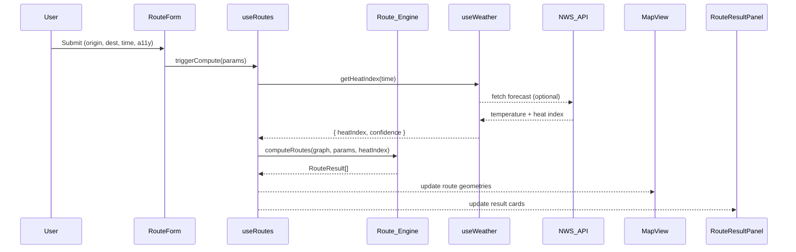
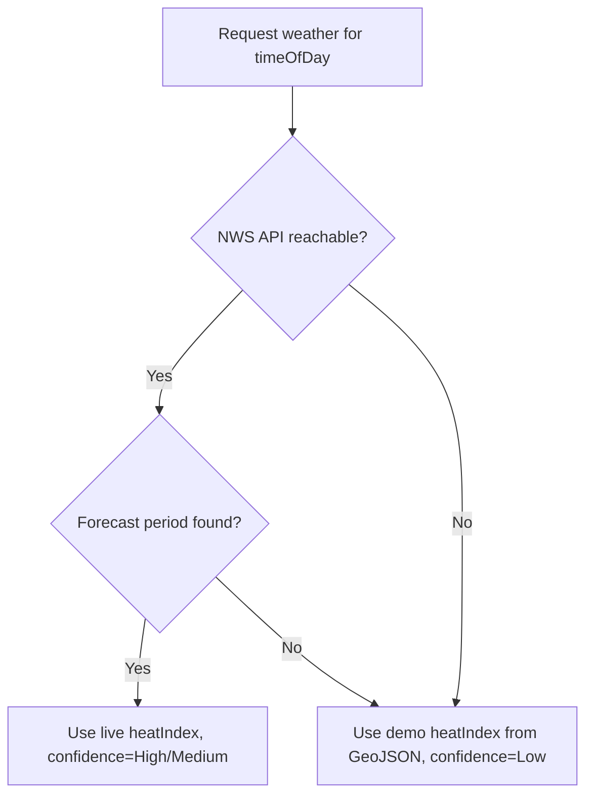

# Design Document: ShadowPath

## Overview

ShadowPath is a mobile-first campus routing web application built with Next.js App Router and TypeScript. It helps ASU Tempe campus users navigate safely during extreme heat by comparing three route types — shortest, shade-aware, and cooling-stop — each annotated with a heat Exposure_Score, a Heat_Safety_Gate verdict, and a Confidence_Label.

The application runs entirely from local static GeoJSON data, with an optional live weather fetch from the National Weather Service API. All route computation happens in pure TypeScript functions that are fully unit-testable with Vitest.

### Key Design Principles

- **Offline-first**: All campus data is bundled as static GeoJSON; no map tile server or external API is required for core functionality.
- **Pure computation core**: The Route_Engine is a side-effect-free TypeScript module, making it straightforward to test with property-based tests.
- **Progressive enhancement**: Weather API integration improves score confidence but degrades gracefully to a demo heat index.
- **Accessibility by default**: High contrast mode, keyboard navigation, and ARIA live regions are first-class concerns, not afterthoughts.

---

## Architecture

### Next.js App Router Structure

```
app/
  layout.tsx                  # Root layout: nav, high-contrast provider, skip link
  page.tsx                    # Home: route input form + map + result panel
  methodology/
    page.tsx                  # Methodology page
  kiro-process/
    page.tsx                  # Kiro Process page
  api/
    weather/
      route.ts                # Server-side weather proxy (NWS API)

lib/
  graph/
    buildGraph.ts             # Constructs Campus_Graph from GeoJSON
    types.ts                  # Graph node/edge TypeScript types
  routing/
    dijkstra.ts               # Generic weighted Dijkstra implementation
    shortestRoute.ts          # Shortest-distance route
    shadeAwareRoute.ts        # Shade-maximising route
    coolingStopRoute.ts       # Cooling-stop route
    exposureScore.ts          # Exposure_Score formula
    heatSafetyGate.ts         # Heat_Safety_Gate threshold logic
    types.ts                  # Route result types
  weather/
    fetchWeather.ts           # NWS API client with fallback
    types.ts                  # Weather data types
  data/
    loadDataset.ts            # Loads and validates GeoJSON at startup

data/
  campus.geojson              # Static ASU Tempe campus dataset

components/
  RouteForm.tsx               # Origin/destination/time/accessibility inputs
  ShadeSlider.tsx             # Time-of-day slider (10 AM / 2 PM / 6 PM)
  MapView.tsx                 # MapLibre GL JS map wrapper
  RouteResultPanel.tsx        # Per-route result card
  HeatSafetyBadge.tsx         # Safe/unsafe badge
  ConfidenceBadge.tsx         # High/Medium/Low confidence label
  TextRouteSummary.tsx        # Non-map accessible text summary
  HighContrastToggle.tsx      # High contrast mode toggle
  Nav.tsx                     # Main navigation

hooks/
  useRoutes.ts                # Orchestrates route computation + state
  useWeather.ts               # Fetches weather data, manages fallback
  useHighContrast.ts          # High contrast mode state

contexts/
  HighContrastContext.tsx     # React context for high contrast mode
```

### Data Flow



### State Management

State is managed with React hooks and context — no external state library is needed given the bounded scope:

| State | Location | Description |
|---|---|---|
| `routeParams` | `useRoutes` | Current form inputs |
| `routeResults` | `useRoutes` | Computed RouteResult[] |
| `selectedTime` | `ShadeSlider` / `useRoutes` | 10 \| 14 \| 18 (hour) |
| `accessibilityMode` | `RouteForm` | boolean |
| `weatherData` | `useWeather` | HeatIndex + confidence |
| `highContrast` | `HighContrastContext` | boolean |
| `graphReady` | `useRoutes` | Campus_Graph loaded flag |

---

## Components and Interfaces

### RouteForm

Renders origin, destination, time-of-day (via ShadeSlider), and accessibility mode toggle. Validates that all fields are populated before calling `useRoutes.triggerCompute`. Displays inline validation errors per field. All inputs have associated `<label>` elements and are keyboard-navigable.

```typescript
interface RouteFormProps {
  onSubmit: (params: RouteParams) => void;
}

interface RouteParams {
  origin: string;
  destination: string;
  timeOfDay: 10 | 14 | 18;
  accessibilityMode: boolean;
}
```

### ShadeSlider

An accessible range/radio control with three labeled stops. Emits `onChange(timeOfDay)`. Operable via keyboard arrow keys. Uses `role="slider"` with `aria-valuemin`, `aria-valuemax`, `aria-valuenow`, and `aria-valuetext`.

```typescript
interface ShadeSliderProps {
  value: 10 | 14 | 18;
  onChange: (value: 10 | 14 | 18) => void;
}
```

### MapView

Wraps MapLibre GL JS (or Leaflet as fallback). Renders path geometries as GeoJSON layers. Shaded segments are styled differently from unshaded segments based on the selected time snapshot. Accepts route geometries as props and re-renders layers on change without full page reload.

```typescript
interface MapViewProps {
  routes: RouteResult[];
  selectedTime: 10 | 14 | 18;
  accessibilityMode: boolean;
}
```

### RouteResultPanel

Renders one card per RouteResult. Each card shows: route type label, shade percentage, sun exposure minutes, Exposure_Score, Confidence_Label, Heat_Safety_Gate verdict, data sources, and key assumptions. Uses `aria-live="polite"` on the container so screen readers announce updates.

```typescript
interface RouteResultPanelProps {
  results: RouteResult[];
  loading: boolean;
}
```

### TextRouteSummary

A non-map text summary of all route results, always visible below the map. Provides equivalent information for users who cannot perceive the map. Structured as a `<dl>` list with `<dt>` / `<dd>` pairs.

---

## Data Models

### GeoJSON Schema

The static `campus.geojson` file uses a `FeatureCollection` with the following feature types, distinguished by `properties.type`:

#### Node Features (Point geometry)

```typescript
interface CampusNodeProperties {
  type: "building" | "cooling_point" | "water_refill" | "intersection";
  id: string;           // Unique node ID
  name: string;         // Human-readable name
  accessible: boolean;  // Wheelchair/mobility compatible
  demoHeatIndex?: number; // °F, used as fallback when Weather_API unavailable
}
```

#### Edge Features (LineString geometry)

```typescript
interface CampusEdgeProperties {
  type: "path";
  id: string;
  fromNodeId: string;
  toNodeId: string;
  distanceMeters: number;
  accessible: boolean;          // Accessibility_Flag
  shade: {
    "10": number;  // Shade coverage % at 10 AM (0–100)
    "14": number;  // Shade coverage % at 2 PM (0–100)
    "18": number;  // Shade coverage % at 6 PM (0–100)
  };
  hasCoolingPoint: boolean;
  hasWaterRefill: boolean;
  shadeStructures: string[];    // Names of shade structures on this edge
}
```

### Campus_Graph (In-Memory)

```typescript
interface GraphNode {
  id: string;
  name: string;
  accessible: boolean;
  type: CampusNodeProperties["type"];
  coordinates: [number, number]; // [lng, lat]
  demoHeatIndex?: number;
}

interface GraphEdge {
  id: string;
  from: string;       // Node ID
  to: string;         // Node ID
  distanceMeters: number;
  accessible: boolean;
  shade: Record<"10" | "14" | "18", number>;
  hasCoolingPoint: boolean;
  hasWaterRefill: boolean;
  geometry: GeoJSON.LineString;
}

interface CampusGraph {
  nodes: Map<string, GraphNode>;
  edges: Map<string, GraphEdge>;
  adjacency: Map<string, GraphEdge[]>; // nodeId -> outgoing edges
}
```

### Route Result

```typescript
type RouteType = "shortest" | "shade-aware" | "cooling-stop";
type ConfidenceLabel = "High" | "Medium" | "Low";
type SafetyVerdict = "safe" | "unsafe";

interface RouteResult {
  type: RouteType[];          // May satisfy multiple types if paths are identical
  path: string[];             // Ordered node IDs
  edges: GraphEdge[];         // Ordered edges
  distanceMeters: number;
  durationMinutes: number;    // Estimated walking time
  shadePercentage: number;    // Weighted average shade across edges
  sunExposureMinutes: number; // durationMinutes * (1 - shadePercentage/100)
  coolingStopCount: number;
  exposureScore: number;      // 0–100
  confidenceLabel: ConfidenceLabel;
  safetyVerdict: SafetyVerdict;
  dataSources: string[];
  assumptions: string[];
  geometry: GeoJSON.FeatureCollection; // For map rendering
}
```

### Weather Data

```typescript
interface WeatherData {
  heatIndex: number;        // °F
  temperature: number;      // °F
  confidence: "High" | "Medium" | "Low";
  source: "nws-live" | "nws-forecast" | "demo-fallback";
  fetchedAt: Date | null;
}
```

---

## Route Engine Algorithms

### Graph Construction (`buildGraph.ts`)

Parses the GeoJSON FeatureCollection and populates `CampusGraph`. Validates that every edge references existing node IDs. Throws a typed error if the dataset is missing or malformed, which the UI catches to display the dataset-unavailable message.

### Dijkstra Core (`dijkstra.ts`)

A generic priority-queue Dijkstra implementation parameterised by an edge-weight function:

```typescript
function dijkstra(
  graph: CampusGraph,
  startId: string,
  endId: string,
  weightFn: (edge: GraphEdge) => number,
  filter?: (edge: GraphEdge) => boolean
): { path: string[]; edges: GraphEdge[]; totalWeight: number } | null
```

The `filter` parameter is used to exclude non-accessible edges when `accessibilityMode` is true.

### Shortest Route (`shortestRoute.ts`)

Weight function: `edge.distanceMeters`. Finds the minimum-distance path.

### Shade-Aware Route (`shadeAwareRoute.ts`)

Weight function: `edge.distanceMeters * (1 - shade[timeKey] / 100) + epsilon`

Where `epsilon = 0.01` prevents zero-weight edges. This minimises the "unshaded distance" — effectively maximising shade coverage while still preferring shorter paths when shade is equal.

### Cooling-Stop Route (`coolingStopRoute.ts`)

Uses a modified Dijkstra that:
1. Computes the shortest route distance `D_min`.
2. Runs Dijkstra with weight function that heavily rewards edges with `hasCoolingPoint: true` (negative bonus applied as a subtracted constant).
3. Rejects any path whose total distance exceeds `1.5 * D_min`.
4. Falls back to the shortest route if no cooling-stop path satisfies the distance constraint.

### Exposure_Score Formula (`exposureScore.ts`)

```
Exposure_Score = clamp(
  W_duration * normDuration
  + W_shade    * (1 - shadePercentage / 100)
  + W_heat     * normHeatIndex
  - W_cooling  * coolingBonus
  + W_a11y     * accessibilityPenalty,
  0, 100
) * 100
```

Where:
- `normDuration = durationMinutes / MAX_DURATION` (MAX_DURATION = 30 min)
- `normHeatIndex = clamp((heatIndex - 80) / 40, 0, 1)` (80°F baseline, 120°F max)
- `coolingBonus = min(coolingStopCount / 3, 1)` (capped at 3 stops)
- `accessibilityPenalty = accessibilityMode ? 0.05 : 0` (slight penalty for longer accessible detours)
- Default weights: `W_duration=0.30, W_shade=0.35, W_heat=0.25, W_cooling=0.10, W_a11y=0.05`
- All weights sum to 1.0 (W_a11y is additive penalty, not a weight in the sum)

The weights are exported as a named constant `DEFAULT_EXPOSURE_WEIGHTS` so tests can override them.

### Heat_Safety_Gate (`heatSafetyGate.ts`)

```typescript
const UNSAFE_THRESHOLD = 75;

function evaluateSafety(exposureScore: number): SafetyVerdict {
  return exposureScore > UNSAFE_THRESHOLD ? "unsafe" : "safe";
}
```

Applied to every route result before returning from `computeRoutes`. The threshold is a named constant to make it easy to test boundary conditions.

---

## Weather API Integration

### NWS API Client (`fetchWeather.ts`)

The National Weather Service API is called server-side via a Next.js API route (`/api/weather`) to avoid CORS issues. The client:

1. Fetches the NWS points endpoint for ASU Tempe coordinates: `https://api.weather.gov/points/{lat},{lon}`
2. Follows the `forecastHourly` URL from the response.
3. Finds the forecast period matching the selected time-of-day snapshot.
4. Extracts temperature and heat index (or computes heat index from temperature + humidity using the Rothfusz regression if not provided directly).

### Fallback Strategy



The demo heat index is stored on the nearest `building` node in the GeoJSON dataset (`demoHeatIndex` property). The fallback value is 105°F for Tempe summer conditions.

### Confidence Label Assignment

| Condition | Confidence |
|---|---|
| Live NWS forecast, < 6 hours ahead | High |
| Live NWS forecast, 6–24 hours ahead | Medium |
| Demo fallback | Low |

---

## Shade_Slider State Management

The `ShadeSlider` component is a controlled component. Its value (`10 | 14 | 18`) is lifted to `useRoutes`, which re-runs `computeRoutes` whenever the slider changes. The re-computation is synchronous (pure functions, in-memory graph) and completes well within the 1-second update requirement.

```typescript
// useRoutes.ts (simplified)
const [selectedTime, setSelectedTime] = useState<10 | 14 | 18>(10);

const handleTimeChange = useCallback((time: 10 | 14 | 18) => {
  setSelectedTime(time);
  if (lastParams) {
    const results = computeRoutes(graph, { ...lastParams, timeOfDay: time }, weatherData);
    setRouteResults(results);
  }
}, [graph, lastParams, weatherData]);
```

---

## Map Rendering

### Library Choice: MapLibre GL JS

MapLibre GL JS is chosen over Leaflet for:
- Vector tile support (future-proofing)
- Better performance for dynamic layer updates
- No licensing restrictions (MIT)
- Native GeoJSON layer support

The map is rendered in a `<div>` with `role="application"` and `aria-label="Campus route map"`. A `TextRouteSummary` component always renders below the map as a non-visual alternative.

### Layer Strategy

Three GeoJSON sources are registered on map load:
- `campus-edges`: All path edges (base layer, grey)
- `route-{type}`: One source per route type, updated on recompute
- `shade-overlay`: Edges coloured by shade percentage for the selected time

Shade colouring uses a colour ramp: dark green (100% shade) → yellow (50%) → red (0% shade). In high contrast mode, the ramp switches to a blue–white–orange palette with higher contrast ratios.

---

## Accessibility Architecture

### High Contrast Mode

`HighContrastContext` provides a boolean `highContrast` value. When true, a `data-high-contrast="true"` attribute is set on `<html>`. Tailwind CSS uses a custom variant `hc:` (configured via `addVariant`) to apply high-contrast overrides:

```css
/* Minimum 7:1 contrast ratio */
[data-high-contrast="true"] .text-primary { color: #000000; }
[data-high-contrast="true"] .bg-surface  { background: #FFFFFF; }
```

The toggle is in the main navigation and persists to `localStorage`.

### Keyboard Navigation

- All form controls use native HTML elements (`<input>`, `<select>`, `<button>`) for free keyboard support.
- `ShadeSlider` uses `role="slider"` with `onKeyDown` handling for ArrowLeft/ArrowRight.
- Focus order follows DOM order; no `tabindex` values greater than 0 are used.
- A skip-to-content link is the first focusable element in the layout.

### ARIA

- `RouteResultPanel` container: `aria-live="polite"` so screen readers announce new results.
- `HeatSafetyBadge`: `role="status"` with descriptive `aria-label`.
- `MapView` wrapper: `role="application"`, `aria-label="Campus route map"`.
- All dynamic content regions have `aria-atomic="true"` where appropriate.

### Focus Management

After form submission, focus moves to the result panel heading using `useEffect` + `ref.current.focus()`. This ensures keyboard and screen reader users are immediately aware of new results.

---

## Error Handling

| Scenario | Behaviour |
|---|---|
| GeoJSON file missing | Display "Campus data unavailable" error; disable route form |
| GeoJSON malformed | Same as above; log parse error to console |
| Weather API unreachable | Use demo fallback; attach Confidence_Label "Low" |
| Origin/destination not found in graph | Inline form error: "Location not found in campus data" |
| No path exists between nodes | Result panel: "No route found between these locations" |
| All routes unsafe | Result panel: recommend shuttle / cooling point; no "safe" label shown |
| Route form submitted with empty fields | Inline validation errors per field; Route_Engine not invoked |

---

## Correctness Properties


*A property is a characteristic or behavior that should hold true across all valid executions of a system — essentially, a formal statement about what the system should do. Properties serve as the bridge between human-readable specifications and machine-verifiable correctness guarantees.*

### Property 1: Accessibility mode excludes inaccessible edges

*For any* Campus_Graph and any origin–destination pair, when `accessibilityMode` is `true`, every edge in every returned route SHALL have `accessible === true`.

**Validates: Requirements 1.5, 11.4**

---

### Property 2: Form validation rejects incomplete submissions

*For any* combination of missing required fields (origin, destination, timeOfDay, accessibilityMode), the form validation function SHALL return at least one error per missing field and SHALL NOT invoke `computeRoutes`.

**Validates: Requirements 1.3**

---

### Property 3: computeRoutes returns all three route types

*For any* valid Campus_Graph and any reachable origin–destination pair, `computeRoutes` SHALL return results that collectively cover the `"shortest"`, `"shade-aware"`, and `"cooling-stop"` route types (accounting for merged results when paths are identical).

**Validates: Requirements 3.1**

---

### Property 4: Shortest route has minimum distance

*For any* valid Campus_Graph and any reachable origin–destination pair, the distance of the shortest route SHALL be less than or equal to the distance of the shade-aware route and the cooling-stop route.

**Validates: Requirements 3.2**

---

### Property 5: Shade-aware route maximises shade coverage

*For any* valid Campus_Graph and any reachable origin–destination pair, the `shadePercentage` of the shade-aware route SHALL be greater than or equal to the `shadePercentage` of the shortest route.

**Validates: Requirements 3.3**

---

### Property 6: Cooling-stop route respects distance constraint

*For any* valid Campus_Graph and any reachable origin–destination pair, the distance of the cooling-stop route SHALL be less than or equal to 1.5 times the distance of the shortest route.

**Validates: Requirements 3.4**

---

### Property 7: Exposure_Score is always in range [0, 100]

*For any* valid route inputs (duration, shade percentage, heat index, cooling stop count, accessibility mode), the `computeExposureScore` function SHALL return a value in the closed interval [0, 100].

**Validates: Requirements 3.6, 4.1**

---

### Property 8: Shade percentage monotonically decreases Exposure_Score

*For any* fixed route inputs, if shade percentage `s1 < s2`, then `computeExposureScore(..., s1, ...) >= computeExposureScore(..., s2, ...)`. Increasing shade coverage SHALL never increase the Exposure_Score.

**Validates: Requirements 4.6, 11.6**

---

### Property 9: Heat_Safety_Gate threshold is consistent across all route types

*For any* `exposureScore` value and any `routeType`, `evaluateSafety(exposureScore)` SHALL return `"unsafe"` if and only if `exposureScore > 75`, regardless of route type.

**Validates: Requirements 5.2, 5.6**

---

### Property 10: Shade slider recomputes routes with correct time snapshot

*For any* valid route params and any time value `t ∈ {10, 14, 18}`, the shade percentages in the returned routes SHALL be derived from `edge.shade[t]` for the selected time snapshot.

**Validates: Requirements 6.2**

---

### Property 11: Result panel contains all required fields for any route result

*For any* `RouteResult`, the rendered `RouteResultPanel` SHALL contain: shade percentage, sun exposure minutes, Exposure_Score, Confidence_Label, at least one data source, and at least one assumption.

**Validates: Requirements 7.1, 7.4**

---

### Property 12: Sun exposure minutes is always a rounded whole number

*For any* `sunExposureMinutes` value, the value stored on `RouteResult` SHALL equal `Math.round(durationMinutes * (1 - shadePercentage / 100))` — a non-negative integer.

**Validates: Requirements 7.2**

---

### Property 13: Text route summary mirrors route results

*For any* array of `RouteResult[]`, the rendered `TextRouteSummary` SHALL contain text representations of every route type, Exposure_Score, and safety verdict present in the results array.

**Validates: Requirements 10.5**

---

### Property 14: Campus_Graph serialization round-trip

*For any* `CampusGraph` constructed from valid GeoJSON, serialising the graph to JSON and deserialising it SHALL produce a graph with identical node count, edge count, and edge weights.

**Validates: Requirements 11.2**

---

## Testing Strategy

### Framework

All tests use **Vitest** with the `@fast-check/vitest` adapter for property-based testing. No other test framework is introduced.

### PBT Applicability Assessment

ShadowPath's Route_Engine is a collection of pure TypeScript functions with clear input/output behaviour, large input spaces (arbitrary graphs, arbitrary numeric inputs), and universal properties that hold across all valid inputs. Property-based testing is highly appropriate for the core computation layer.

PBT is NOT used for:
- Map rendering (MapLibre GL JS layer updates) — snapshot tests instead
- UI layout and styling — visual regression / axe-core instead
- Weather API integration — mock-based example tests instead
- Navigation and page routing — example tests instead

### Property-Based Tests (Vitest + fast-check)

Each property test runs a minimum of **100 iterations**. Each test is tagged with a comment referencing the design property:

```
// Feature: shadow-path, Property N: <property_text>
```

| Property | Test File | Generator Strategy |
|---|---|---|
| P1: Accessibility excludes inaccessible edges | `routing/accessibility.test.ts` | Arbitrary graph with mixed accessible flags |
| P2: Validation rejects incomplete forms | `routing/validation.test.ts` | Arbitrary subsets of missing fields |
| P3: All three route types returned | `routing/computeRoutes.test.ts` | Arbitrary connected graphs |
| P4: Shortest route minimum distance | `routing/shortestRoute.test.ts` | Arbitrary connected graphs |
| P5: Shade-aware maximises shade | `routing/shadeAwareRoute.test.ts` | Arbitrary graphs with shade values |
| P6: Cooling-stop distance constraint | `routing/coolingStopRoute.test.ts` | Arbitrary graphs with cooling points |
| P7: Exposure_Score in [0,100] | `routing/exposureScore.test.ts` | Arbitrary numeric inputs in valid ranges |
| P8: Shade monotonicity | `routing/exposureScore.test.ts` | Fixed inputs, varying shade 0–100 |
| P9: Gate threshold consistency | `routing/heatSafetyGate.test.ts` | Arbitrary scores and route types |
| P10: Slider uses correct time snapshot | `routing/shadeSlider.test.ts` | Arbitrary graphs, all three time values |
| P11: Result panel required fields | `components/RouteResultPanel.test.tsx` | Arbitrary RouteResult objects |
| P12: Sun exposure minutes rounded | `routing/exposureScore.test.ts` | Arbitrary duration and shade values |
| P13: Text summary mirrors results | `components/TextRouteSummary.test.tsx` | Arbitrary RouteResult[] arrays |
| P14: Graph serialization round-trip | `graph/buildGraph.test.ts` | Arbitrary valid GeoJSON datasets |

### Unit / Example Tests

- `heatSafetyGate.test.ts`: Boundary tests at scores 74, 75, 76 (Requirement 11.3)
- `buildGraph.test.ts`: Malformed GeoJSON throws typed error (Requirement 2.4)
- `fetchWeather.test.ts`: Mock NWS failure → demo fallback + Confidence_Label "Low" (Requirement 4.3)
- `fetchWeather.test.ts`: Mock NWS success → live heat index + Confidence_Label "High"/"Medium" (Requirement 4.4)
- `RouteResultPanel.test.tsx`: Confidence_Label "Low" renders explanatory note (Requirement 7.3)
- `RouteForm.test.tsx`: All four fields present in DOM (Requirement 1.1)
- `ShadeSlider.test.tsx`: ArrowRight keydown advances slider value (Requirement 6.6)

### Integration / Smoke Tests

- Load `campus.geojson` and assert required feature type counts (Requirements 2.1, 2.5)
- Load `campus.geojson` and assert each edge has `shade.10`, `shade.14`, `shade.18` (Requirement 6.4)
- axe-core audit on `RouteResultPanel`, `MethodologyPage`, `KiroProcessPage` (Requirements 7.5, 8.5, 9.3)

---

## Methodology Page Structure

The `/methodology` page is a static Next.js page with the following sections:

1. **How Exposure_Score is Calculated** — formula with all variables, weights, and their rationale
2. **Data Sources** — campus.geojson provenance, NWS API, manual seeding notes
3. **Known Limitations** — hackathon data, no real-time shade sensors, static time snapshots, no live pedestrian density
4. **Responsible Design Decisions** — at minimum:
   - Heat_Safety_Gate threshold rationale (75/100 based on OSHA heat stress guidelines)
   - Confidence_Label system design (transparency about data quality)
   - Fallback to demo data rather than silently using stale data
   - Accessibility-first routing (opt-in, not opt-out)

All content is structured with semantic HTML (`<article>`, `<section>`, `<h2>`, `<p>`) and is fully keyboard-navigable.

---

## Kiro Process Page Structure

The `/kiro-process` page displays the full spec-driven development artefacts:

1. **Requirements** — rendered Markdown from `requirements.md` (or a link to the file)
2. **Design** — rendered Markdown from `design.md` (or a link to the file)
3. **Tasks** — rendered Markdown from `tasks.md` (or a link to the file)
4. **Test Plan** — summary of the testing strategy from this design document
5. **Experiment Log** — a running log of decisions, pivots, and findings during development

The page uses `next-mdx-remote` or simple `<pre>` blocks to render the Markdown content. All sections are navigable via a sticky in-page table of contents with keyboard-accessible anchor links.
