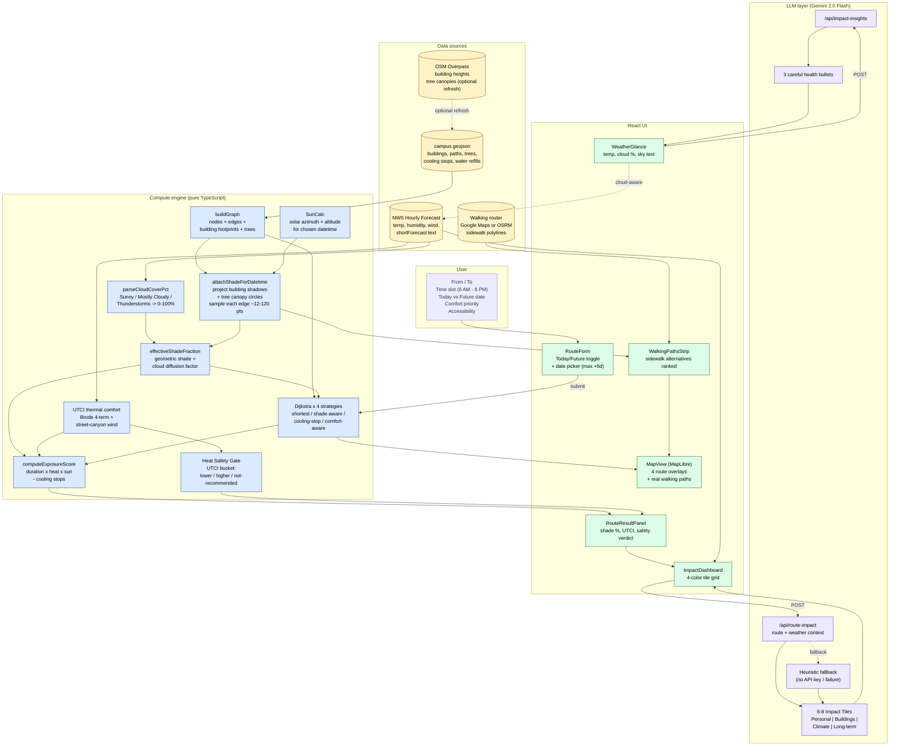

# ShadowPath

[shade-path.netlify.app](https://shade-path.netlify.app)

**Pick a walking path that respects the sun.**

ShadowPath is a campus routing app for ASU Tempe that picks walking routes based on real shade — not just distance. Tell it where you're going and when, and it shows you which path keeps you out of the sun, how it feels in the heat, and what that small choice ripples out to.

Built for the **Kiro Spark Challenge (Environment Accountability Guardrail)** using a fully spec-driven workflow.

---

## The butterfly effect of walking in shade

A single shaded walk seems trivial. Stack the consequences and it isn't:

- **Your body** stays cooler → less sweat → less dehydration → lower heat-illness risk that day.
- **Less sunburn / UV** on this trip → over a semester, less cumulative skin damage and lower long-term skin-cancer risk.
- **You arrive cooler** → the building's AC has less work to do bringing you back to baseline.
- **AC works less** → less electricity drawn → less natural gas burned at the grid → fewer kg of CO₂ released.
- **Lower peak load** during 4 PM Phoenix grid stress → fewer brownouts, less stress on the urban heat island feedback loop.
- **You feel better on arrival** → sharper focus in class or at work.
- **Multiply by 70,000 students** doing this daily → measurable campus-scale energy and emissions deltas.

ShadowPath's job is to make that chain visible and actionable in 2 seconds, not buried in a sustainability report.

---

## Architecture & data flow



### Reading the diagram

The pipeline is layered, not magical:

1. **You pick** a trip and a time. If you pick "Future", you also pick a calendar day up to 6 days out.
2. **Static + live data load.** Buildings/paths come from `campus.geojson`. Weather comes from the National Weather Service. Real sidewalk polylines come from Google Maps or OSRM.
3. **Sun position is computed** for the exact datetime you chose using SunCalc (no hardcoded "morning vs afternoon" — it's astronomy).
4. **Shadows are projected** from each building's footprint and height onto the ground. Tree canopies become circles offset by sun angle. Each path edge is sampled at 12–120 points and asked: "are you in shadow?"
5. **Clouds blur the sky.** NWS short-forecast text ("Mostly Sunny", "Thunderstorms") is mapped to a cloud-cover percentage. Heavy clouds collapse the gap between sunny and shaded paths because diffuse light hits everything.
6. **UTCI** (the WHO-endorsed thermal comfort index) computes how it actually feels for your body — wind, humidity, radiation, all four.
7. **Four Dijkstra variants** find candidate routes: shortest, most shade, most cooling stops, comfort-weighted.
8. **Gemini turns the numbers into a story.** The Impact Dashboard sends the route stats to an LLM endpoint that returns 6–8 categorized tiles — heat strain, hydration saved, AC load avoided, CO₂e pressure, cognitive load, long-term skin risk.

Everything is plain TypeScript. No state machines, no external orchestration. The whole pipeline runs on every form submit.

---

## What it does (features in plain English)

### Pick now or pick later
Plan for right now, or pick any day up to 6 days out. The sun moves across the sky differently in November than in April; ShadowPath redoes the geometry for whatever day you ask for.

### Real shade, not guessed shade
Building footprints + heights + actual sun angle = projected shadows on the ground. We sample your path point-by-point and ask each point if it's in shadow. Trees do the same with canopy circles. Same math used for any datetime past or future.

### Cloud-aware scoring
Cloudy sky? Shade matters less, because diffuse light hits everything. Clear sky? Shade matters a lot. ShadowPath reads the NWS short-forecast text, parses it into a cloud-cover percentage, and tunes its scoring accordingly.

### Four route strategies, ranked
- **Shortest** — least distance, no other concerns.
- **Shade-aware** — maximizes time in shadow at your chosen hour.
- **Cooling-stop** — routes through campus cooling zones / water refills.
- **Comfort-aware** — UTCI-weighted, blends distance + comfort + indoor segments.

You see all four on the map and a ranked walking-paths strip with real sidewalks.

### Impact Dashboard (powered by Gemini)
Once you pick a route, the dashboard shows what that small choice does:
- **Personal** — body heat strain, hydration saved, sunscreen / year, heat-illness risk.
- **Buildings** — AC load on arrival, building cooling demand.
- **Climate** — CO₂e pressure on the Phoenix grid.
- **Long term** — cumulative skin damage, cognitive performance.

If the LLM is unavailable, a built-in heuristic fallback fills the same tiles. The dashboard never stays empty.

### HeatShield Planner (full-day mode)
Plan a whole day with 2–5 commitments. The planner computes every transition, gives you a heat budget, recommends cooling breaks, and suggests campus shuttle alternatives when a walk is rated higher-risk.

### Accessibility-first
Wheelchair-friendly paths only, high-contrast theme, keyboard-navigable form, ARIA-labeled controls, screen-reader-friendly route summaries. Property-based axe tests in CI.

---

## What's novel

- **Time-travel shade.** Most "find shade" tools snapshot one moment. ShadowPath recomputes shadows for any datetime — including future dates — using SunCalc + your campus building geometry. The sun angle in October at 5 PM is *not* the same as in April at 5 PM, and the shaded route differs.
- **Cloud-aware diffusion model.** Cloud cover is rarely wired into urban shade tools. We extract it from NWS forecast text and apply a "diffusion factor" so cloudy days don't pretend the shade gap is the same as on a clear day.
- **LLM as a translator, not an oracle.** The compute engine produces hard numbers. The LLM only translates them into human framing across 4 categories. Numbers come from physics; narrative comes from the model. Heuristic fallback ensures the UI is never broken if the API key is missing.
- **Four routing strategies in one Dijkstra core.** Same graph, different edge-cost functions. Shade-aware, cooling-stop, and comfort-aware are all variants of one well-tested algorithm.
- **UTCI-driven safety verdicts**, not arbitrary thresholds. We use the international thermal comfort standard with a Brode 4-term approximation and street-canyon wind correction.

---

## Research grounding

- **UTCI (Universal Thermal Climate Index)** — Brode et al., 2012. The WHO-endorsed thermal comfort metric used here for "how it actually feels", with a published 4-term polynomial approximation.
- **SunCalc** — solar position library (Mourner, BSD-2). Returns azimuth and altitude for any lat/long/datetime.
- **NWS Hourly Forecast API** — official US National Weather Service forecast, ~7-day horizon at hourly resolution.
- **OSM Overpass API** — public OpenStreetMap query interface for building heights and tree species.
- **Phoenix urban heat island** — Hondula et al., ASU Center for Urban Climate Research; informs the framing that small reductions in cooling demand compound at scale.
- **Heat illness epidemiology** — CDC heat-related illness guidance informs the "lower-risk / higher-risk / not recommended" gate, which intentionally avoids the word "safe".

---

## Tech stack

| Layer | Tech |
|---|---|
| Framework | Next.js 14 App Router |
| Language | TypeScript |
| Styling | Tailwind CSS (custom `hc:` high-contrast variant) |
| Map | MapLibre GL |
| Geometry | Turf.js |
| Solar position | SunCalc |
| Weather | National Weather Service API (server proxy + graceful fallback) |
| Walking routes | Google Maps Directions or OSRM |
| LLM | Google Gemini 2.0 Flash (impact dashboard + insights) |
| Testing | Vitest + fast-check (property-based) + jest-axe |
| Data | Static GeoJSON + optional OSM Overpass refresh |

The whole compute engine is pure functions with no side effects. The UI is a thin React layer on top.

---

## Local setup

```bash
npm install
npm run dev
```

Open [http://localhost:3000](http://localhost:3000).

The app works offline-ish from a static GeoJSON dataset; no key required for core routing. To turn on the live extras, set in `.env.local`:

```
GOOGLE_MAPS_API_KEY=...   # optional: better walking polylines
GEMINI_API_KEY=...        # optional: LLM impact dashboard
```

To refresh building/tree dimensions from live OpenStreetMap:

```bash
npm run generate-data -- --force --live
```

---

## Tests

```bash
npm run test:run          # full vitest pass
npm run test              # watch mode
```

The test suite covers the routing core, exposure scoring, UTCI math, shade geometry properties (with fast-check), accessibility (with jest-axe), and React component behavior.

---

## Project structure

```
src/app/                  # Next.js pages + API routes
  api/
    weather/              # NWS proxy with date+time params
    route-impact/         # LLM impact tiles (with fallback)
    impact-insights/      # LLM health bullets
    walking-directions/   # Google / OSRM proxy
    tiles/                # OSM tile passthrough
lib/
  graph/                  # campus graph builder
  routing/                # Dijkstra + 4 strategies + scoring
  shadow/                 # sun-driven shade geometry
  weather/                # NWS client + cloud parser
  comfort/                # UTCI + edge comfort
  walking/                # polyline decoding + shade sampling
  planner/                # HeatShield day planner
data/campus.geojson       # ASU Tempe static dataset
components/               # React UI
hooks/                    # useRoutes, useWeather, ...
__tests__/                # vitest + fast-check + axe
```

---

## HeatShield Planner

HeatShield Planner extends ShadowPath from a single-route comparison tool into a full-day heat-risk planner. The tagline: **"Plan your school day around heat, not just time."**

### Day Planner
Enter 2–5 campus commitments for your day (location, time, flexibility). The planner computes route segments between each consecutive pair and produces per-transition heat-risk analysis — walking time, sun exposure, shade percentage, cooling/water availability, confidence label, and risk level. A preloaded demo schedule is available for quick evaluation.

### Heat Budget Dashboard
A visual budget showing how much of your daily heat exposure each walking segment consumes. Shaded routes, cooling stops, and shuttle alternatives reduce consumed budget. The dashboard displays remaining vs consumed budget, the highest-risk time block, recommended cooling break timing, and estimated reduction compared to shortest-route-only planning.

### Shuttle Alternatives
When a walking segment is classified as "higher-risk" or "not recommended", the planner recommends nearby campus shuttle stops as alternatives — including stop name, estimated wait time, walking distance, and wheelchair accessibility.

### Personal Heat Mode
Configurable preferences that tailor route recommendations to individual needs: standard walking, low exertion, wheelchair-accessible, asthma-sensitive, prefer shaded paths, prefer water refill stops, prefer cooling stops, and prefer shuttle alternatives during high-risk periods.

### Responsible language
HeatShield Planner never uses the word "safe". All risk assessments use "lower-risk", "higher-risk", or "not recommended". The planner includes prototype disclaimers, demo data notes, and methodology transparency — it is intended for planning and awareness purposes, not as a substitute for official heat safety guidance.

---

## Kiro spec-driven workflow

ShadowPath was built end-to-end using the **Kiro spec-driven workflow**:

1. **Requirements** — user stories and acceptance criteria first, before any code.
2. **Design** — architecture, data models, algorithms, correctness properties, and testing strategy derived from requirements.
3. **Tasks** — implementation plan generated from the design, with each task linked to specific requirements.
4. **Tests** — 14 correctness properties (P1–P14) implemented as property-based tests with fast-check, plus unit tests for boundary conditions and error paths.
5. **Kiro Process page** — the running spec artefacts are surfaced in the app at `/kiro-process` for full transparency.

The full spec lives in `.kiro/specs/shadow-path/`. The Kiro Process page in the app renders or links to each artefact so evaluators can verify the workflow end-to-end.
